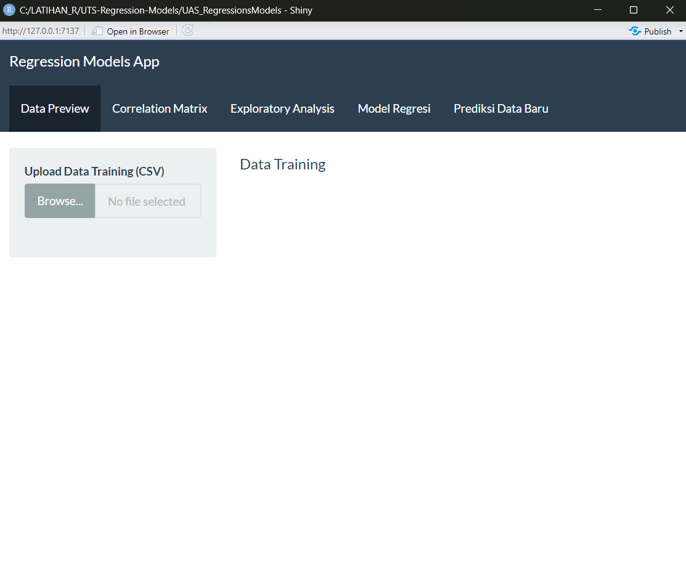

```{=html}
<style>
body {
  text-align: justify;
}
</style>
```

```{r setup, include=FALSE}
knitr::opts_chunk$set(echo = TRUE)
```

# Deskripsi Aplikasi Regression Models App

Aplikasi ini dibuat menggunakan R Shiny untuk keperluan UAS mata kuliah *Regression Models*. Tujuannya adalah memberikan antarmuka interaktif untuk proses eksplorasi data, membangun model regresi linier, dan melakukan prediksi pada data baru.

---

## Desain Aplikasi

Aplikasi ini menggunakan `navbarPage` dengan tema `flatly` dan terdiri atas 5 tab utama:

1. **Data Preview**
2. **Correlation Matrix**
3. **Exploratory Analysis**
4. **Model Regresi**
5. **Prediksi Data Baru**

Setiap tab memiliki fungsi tersendiri yang saling terhubung secara alur kerja.

*Gambar Desain Aplikasi*



---

## Alur Aplikasi

1. **Data Preview**
   - Pengguna mengunggah data *training* (CSV).
   - Data ditampilkan dalam bentuk tabel dan ringkasan statistik.

2. **Correlation Matrix**
   - Pengguna memilih variabel numerik.
   - Ditampilkan korelasi antar variabel menggunakan `corrplot`.

3. **Exploratory Analysis**
   - Scatter plot antar dua variabel (X dan Y) dapat dipilih oleh pengguna.
   - Warna titik berdasarkan intensitas nilai Y.

4. **Model Regresi**
   - Pengguna memilih target (Y) dan prediktor (X).
   - Model regresi linier dibangun dan disimpan ke dalam file `model_regresi.rds`.
   - Output berupa ringkasan model (`summary`), statistik ringkasan (`glance`), dan plot aktual vs prediksi.

5. **Prediksi Data Baru**
   - Pengguna mengunggah data *testing*.
   - Model dari `rds` digunakan untuk memprediksi nilai Y berdasarkan variabel X.
   - Hasil prediksi ditampilkan dalam bentuk tabel.

---

## Fungsionalitas

- **fileInput()**: Digunakan pada tab Data Preview dan Prediksi Data Baru untuk membaca dua file CSV yang berbeda (training dan testing).
- **DTOutput()**: Untuk menampilkan data dalam tabel interaktif.
- **plotOutput()**: Menampilkan scatterplot, plot korelasi, dan plot prediksi.
- **reactive() dan eventReactive()**: Untuk memproses data dan model berdasarkan aksi pengguna.
- **saveRDS() dan readRDS()**: Untuk menyimpan dan membaca model regresi.
- **validasi input**: Menggunakan `req()` dan `tryCatch()` untuk menangani kesalahan input.

---
---

## Catatan Penting

- Kolom pada data testing **harus sesuai** dengan variabel prediktor (X) yang digunakan saat pelatihan model.
- Model regresi disimpan sebagai file `.rds` untuk keperluan prediksi.
- Aplikasi menyediakan notifikasi kesalahan apabila terjadi mismatch atau input tidak valid.

---

## Kesimpulan

Aplikasi ini membantu pengguna:

- Mengeksplorasi data secara visual dan statistik
- Membangun model regresi linier berdasarkan variabel pilihan
- Menyimpan model dan menggunakannya untuk memprediksi data baru

